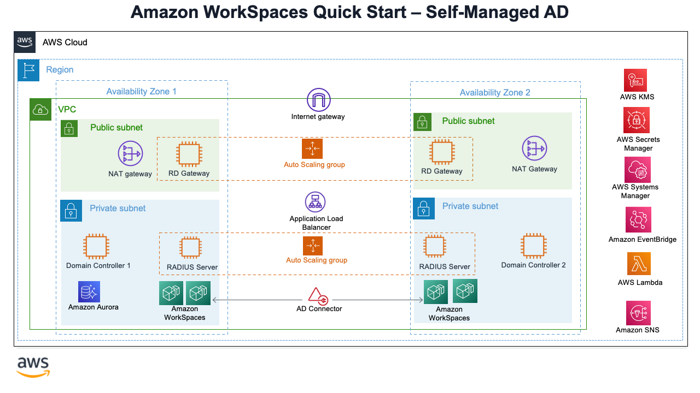

## WorkSpace-MFA-Quickstart

Creation of MFA enabled Amazon WorkSpaces with default KMS encryption Quickstart.

1. **Scenario 1 --> Self-Managed AD with Amazon WorkSpaces - New/Existing VPC**

   
2. **Scenario 2 --> AWS Managed AD with Amazon WorkSpaces - New/Existing VPC**

   
3. **Scenario 3 -->**

* 3a- Create MFA enabled Amazon WorkSpaces in an existing AWS Managed AD Directory Service
* 3b- Create MFA enabled Amazon WorkSpaces in existing Self Managed AD Directory Service

Templates for new VPC creation(Covering Scenarios 1 and 2):
===========================================================

- ws-master-1.template.yaml
- ws-master-2.template.yaml

Templates for existing VPC(Covering Scenarios 1 and 2):
=======================================================

- ws-1.template.yaml
- ws-2.template.yaml

Templates for Launching WorkSpaces(Covering Scenarios 1 and 2):
===============================================================

- workspace-1.template.yaml
- workspace-2.template.yaml

Templates for existing AWS Managed AD Directory Service
=======================================================

- Master template -> ws-master-3a.template
- WorkSpaces -> workspace-3a.template
- Radius -> radius-3a.template.yaml

Templates for existing Self-managed AD (AD Connector)
=====================================================

- Master -> ws-master-3b.template
- WorkSpaces -> workspace-3b.template
- Radius -> radius-3b.template.yam

For architectural details, step-by-step instructions, and customization options, see the [deployment guide](https://aws-quickstart.github.io/quickstart-freeradius-mfa-workspaces/).

To post feedback, submit feature ideas, or report bugs, use the **Issues** section of this GitHub repo.

To submit code for this Quick Start, see the [AWS Quick Start Contributor&#39;s Kit](https://aws-quickstart.github.io/).
