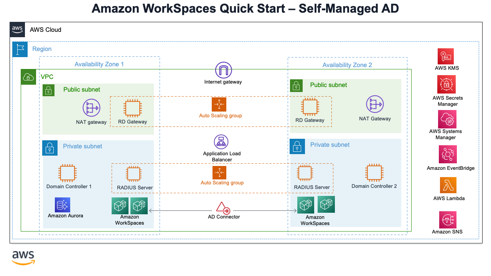
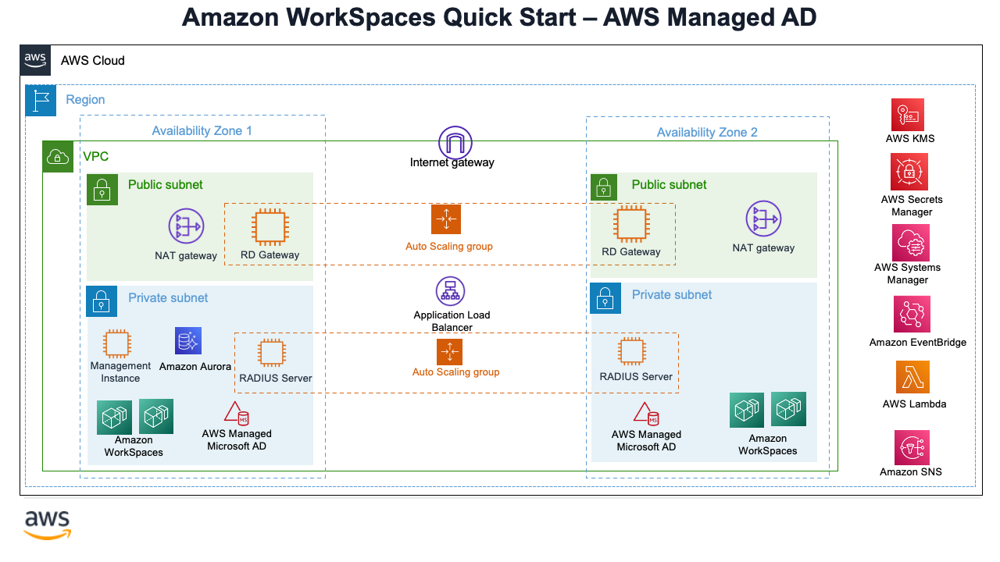

# WorkSpace-MFA-Quickstart

Creation of MFA enabled Amazon WorkSpaces with default KMS encryption Quickstart.

1. **Scenario 1 --> Self-Managed AD with Amazon WorkSpaces - New/Existing VPC**

   
2. **Scenario 2 --> AWS Managed AD with Amazon WorkSpaces - New/Existing VPC**

   
3. **Scenario 3 -->**

    3a- Create MFA enabled Amazon WorkSpaces in an existing Directory Service

Templates for new Deploying in a new VPC(Covering Scenarios 1 and 2):
=====================================================================

- ws-main-1.template
- ws-main-2.template

Templates for Deploying into existing VPC(Covering Scenarios 1 and 2):
======================================================================

- ws-1.template
- ws-2.template

Templates for Launching WorkSpaces(Covering Scenarios 1 and 2):
===============================================================

- workspace-1.template.yaml
- workspace-2.template.yaml

Templates for existing Directory Service (Covering Scenarios 1 and 2)
=====================================================================

- Main template -> ws-master-3.template
- WorkSpaces -> workspace-3.template
- Radius -> radius-3.template.yaml
