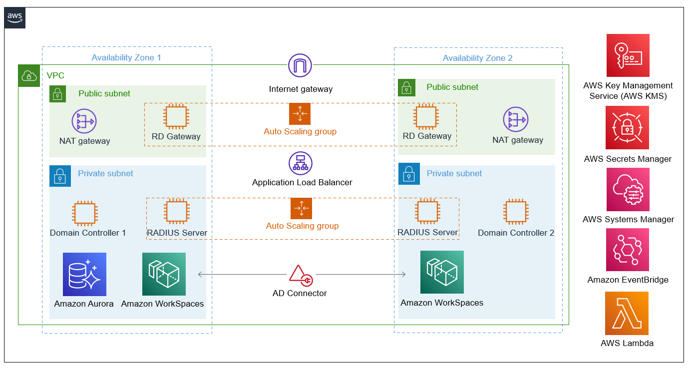
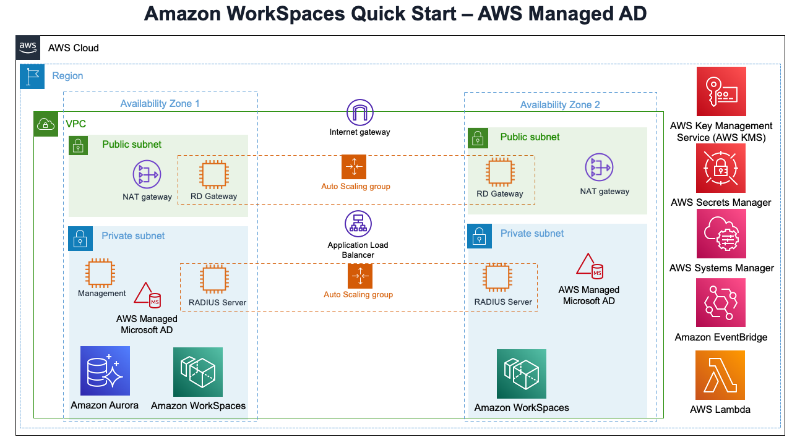
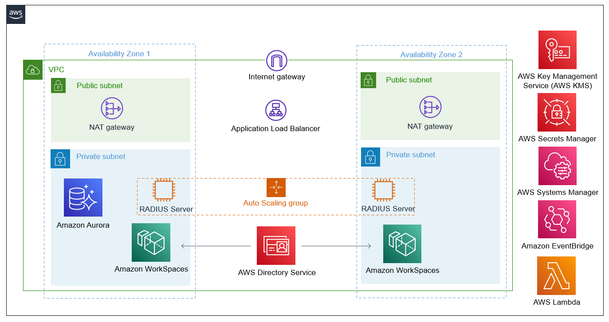

:xrefstyle: short

Deploying this solution with default parameters builds the following {partner-product-name} environment in the AWS Cloud.

* *Scenario 1: Deploy and Configure {partner-product-name} and your own Active Directory Domain Services (AD DS) installation on Amazon Elastic Compute Cloud (Amazon EC2) instances.* The AWS CloudFormation template for this scenario builds the AWS Cloud infrastructure and sets up and configures AD DS and AD-integrated Domain Name Service (DNS) on the AWS Cloud. It also creates AWS Directory Service (AD Connector) but you handle maintenance and adminstration of AD DS tasks. It then deploys {partner-product-name} that is integrated with AD DS and configured and enabled on the AD Connector. You can also choose to deploy into your existing VPC infrastructure. Manual steps are required for users to register the MFA token after deployment. 

* *Scenario 2: Deploy and Configure {partner-product-name} and AWS Directory Service for Microsoft Active Directory.* The AWS CloudFormation template for this scenario builds the base AWS Cloud infrastructure and then deploys AWS Managed Microsoft AD on the AWS Cloud. Directory Service takes care of AD DS tasks such as building a highly available directory topology, monitoring domain controllers, and configuring backups and snapshots. It also deploys {partner-product-name} that is integrated with AD DS and configured and enabled on the AWS Managed Microsoft AD. You can also choose to deploy into your existing VPC infrastructure. Manual steps are required for users to register the MFA token after deployment. 

* *Scenario 3: Deploy and Configure {partner-product-name} in an existing Directory Service.* The AWS CloudFormation template for this scenario builds the base AWS Cloud infrastructure for the {partner-product-name}. It integrates the solution into an existing AD DS and Directory Service. You'll be required to provide credentials of an existing domain user with permissions to make an LDAP request. It also requires an existing Directory Service ID and VPC. This scenario requires that you have Directory Service already created. 

For all new AD DS installations, it deploys AD DS and AD-integrated DNS, and it sets up AD sites and subnets. For all the above scenarios, MFA is enabled on the Directory Service with the solution and a WorkSpace is launched for a domain user. 

// Replace this example diagram with your own. Follow our wiki guidelines: https://w.amazon.com/bin/view/AWS_Quick_Starts/Process_for_PSAs/#HPrepareyourarchitecturediagram. Upload your source PowerPoint file to the GitHub {deployment name}/docs/images/ directory in its repository.

=== Scenario 1: Deploy {partner-product-name} and self-managed AD
<<#architecture1>>
.Scenario 1 - Solution architecture for {partner-product-name} on AWS

// image::../docs/deployment_guide/images/MFA-EnabledWorkSpaceSelf-ManagedAD.png[Architecture]

As shown in <<architecture1>>, this solution sets up the following:

* A highly available architecture that spans two Availability Zones.*
* A virtual private cloud (VPC) configured with public and private subnets, according to AWS
best practices, to provide you with your own virtual network on AWS.*
* In the public subnets:
** Managed network address translation (NAT) gateways to allow outbound
internet access for resources in the private subnets.*
** Remote Desktop Gateway (RD Gateway) instances in an Auto Scaling group to help secure remote access to instances in private subnets.*
* In the private subnets:
** A Windows Server forest and domain functional level controller, including security groups and rules for traffic between instances.
** A WorkSpaces for a specified Domain User. These users are created in Scenarios 1 and 2.
** Directory Service (AD Connector) configured with the AD DS DNS IP addresses.
** A Linux RADIUS server in an Auto Scaling group to allow inbound Secure Shell (SSH) access to Amazon EC2 instances in private subnets.
** Amazon Aurora used as LinOTP database backend for the MFA solution. 
* AWS Key Management Service (AWS KMS) that encrypts the WorkSpace root and user volumes and RADIUS server EBS volumes. 
* AWS Secrets Manager to store passwords.
* AWS Systems Manager automation documents to set up and configure AD DS, AD-integrated DNS, AD Connector, and RADIUS Server and enable MFA on Directory Service.
* AWS Lambda function triggers Systems Manager Automation Document.
* Amazon EventBridge to trigger Systems Manager automation document that configures LinOTP AD integration and RADIUS solution when auto scaling activity of the RADIUS server occurs. 
* AWS KMS that encrypts the WorkSpace root and user volumes and RADIUS server EBS volumes. 
// Add bullet points for any additional components that are included in the deployment. Ensure that the additional components are shown in the architecture diagram. End each bullet with a period.
// * <describe any additional components>.

[.small]#* The template that deploys this into an existing VPC skips the components marked by asterisks and prompts you for your existing VPC configuration.#

=== Scenario 2: Deploy {partner-product-name} and AWS Managed Microsoft Active Directory
Scenario 2 is similar to scenario 1, except that it includes AWS Managed Microsoft AD to provision and manage AD DS on the AWS Cloud. Instead of fully managing AD DS yourself, you rely on Directory Service for tasks such as building a highly available directory topology, monitoring domain controllers, and configuring backups and snapshots.

Directory Service deploys AD DS across multiple Availability Zones, and automatically detects and replaces domain controllers that fail. Directory Service also handles time-consuming tasks such as patch management, software updates, data replication, snapshot backups, replication monitoring, and point-in-time restores. For more information, see https://aws.amazon.com/directoryservice/[AWS Directory Service^] and http://aws.amazon.com/documentation/directory-service/[AWS Directory Service Documentation^].

<<#architecture2>>
.Scenario 2 - Solution architecture for {partner-product-name} on AWS

// image::../docs/deployment_guide/images/MFA-EnabledWorkSpaceSelf-ManagedAD.png[Architecture]

As shown in <<architecture2>>, this solution sets up the following:

* A highly available architecture that spans two Availability Zones.*
* A VPC configured with public and private subnets, according to AWS
best practices, to provide you with your own virtual network on AWS.*
* In the public subnets:
** Managed NAT gateways to allow outbound internet access for resources in the private subnets.*
** RD Gateway instances in an Auto Scaling group to help secure remote access to instances in private subnets.*
* In the private subnets:
** (Required) A Windows EC2 instance to act as a management instance, including security groups and rules for traffic between instances.
** Aurora used as LinOTP database backend for the MFA solution. 
* Systems Manager automation documents to set up and configure AD DS, AD-integrated DNS, RADIUS Server and enable MFA on Directory Service.
* Lambda function triggers Systems Manager automation document.
* Secrets Manager to store credentials.
* Directory Service to provision and manage AD DS in the private subnets.
* EventBridge to trigger Systems Manager automation document that configures LinOTP AD integration and RADIUS solution when auto scaling activity of the RADIUS server occurs. 
* AWS KMS that encrypts the WorkSpace root and user volumes and RADIUS server EBS volumes. 
// Add bullet points for any additional components that are included in the deployment. Ensure that the additional components are shown in the architecture diagram. End each bullet with a period.
// * <describe any additional components>.

[.small]#* The template that deploys this into an existing VPC skips the components marked by asterisks and prompts you for your existing VPC configuration.#

=== Scenario 3: Deploy Amazon WorkSpaces, MFA solution into an existing AWS Directory Service
Scenario 3 is similar to scenarios 1 and 2 above, except that it does not provision the Active Directory part. It requires an existing AWS Directory Service and a Domain user with permissions to make LDAP request to your existing AD. 

<<#architecture2>>
.Scenario 3 - Architecture for Amazon WorkSpaces with FreeRADIUS MFA solution on AWS

// image::../docs/deployment_guide/images/MFA-EnabledWorkSpaceSelf-ManagedAD.png[Architecture]

As shown in <<architecture3>>, the AWS CloudFormation templates that automate this deployment set up the following:

* A highly available architecture that spans two Availability Zones.*
* A virtual private cloud (VPC) configured with public and private subnets, according to AWS
best practices, to provide you with your own virtual network on AWS.*
* In the public subnets:
** Managed network address translation (NAT) gateways to allow outbound
internet access for resources in the private subnets.*
* In the private subnets:
** A Linux RADIUS server in an Auto Scaling group to allow inbound Secure Shell (SSH) access to Amazon Elastic Compute Cloud (Amazon EC2) instances in private subnets.
** Amazon Aurora used as LinOTP database backend for the MFA solution. 
** (Required) An existing AWS Directory Service in supported Amazon WorkSpaces AWS region.
* AWS Systems Manager Automation documents to register AWS DS for Amazon WorkSpaces, RADIUS Server and enable MFA on Directory Service.
* AWS Lambda function triggers Systems Manager Automation Document.
* AWS Secrets Manager to store passwords.
* Amazon EventBridge to trigger AWS Systems Manager Automation document that configures LinOTP AD integration and RADIUS solution when AutoScaling activity of the RADIUS server occurs. 
* Amazon KMS to encrypt the Amazon WorkSpace root and user and RADIUS server EBS volumes. 
// Add bullet points for any additional components that are included in the deployment. Ensure that the additional components are shown in the architecture diagram. End each bullet with a period.
// * <describe any additional components>.

[.small]#* The template that deploys this into an existing VPC skips the components marked by asterisks and prompts you for your existing VPC configuration.#

The WorkSpace Cloudformation nested stack kicks-off AWS Systems Manager Automation document that registers the Directory Service for Amazon WorkSpaces. The last nested stack deploys the RADIUS solution behind an AutoScaling group and Elastic Load Balancer. The AutoScaling activity triggers an SSM Automation Document via Amazon EventBridge. This SSM Automation document fetches AD credentials stored in SSM Parameter Store and Secrets Manager to configure Amazon Aurora for LinOTP, integrates LinOTP with Active Directory, creates self-signed certifcate that is imported to AWS Certificate Manager, creates HTTPS Application Load Balancer listener and updates the registered AWS Directory service for MFA. 

To deploy this stack, follow the step-by-step instructions in the Deployment Steps section. After deploying this stack, you can move on to the configuration of token policy on the deployed RADIUS solution. The portal to administer LinOTP will be in the output of the Cloudformation RADIUS stack. Upload the policy.cfg file, then ask the WorkSpace user to login with AD credentials to enroll token using application such as Google Authenticator. For step-by-step guide on how to upload the policy.cfg file, see https://aws.amazon.com/blogs/desktop-and-application-streaming/integrating-freeradius-mfa-with-amazon-workspaces/[Step 3 of this blog post].