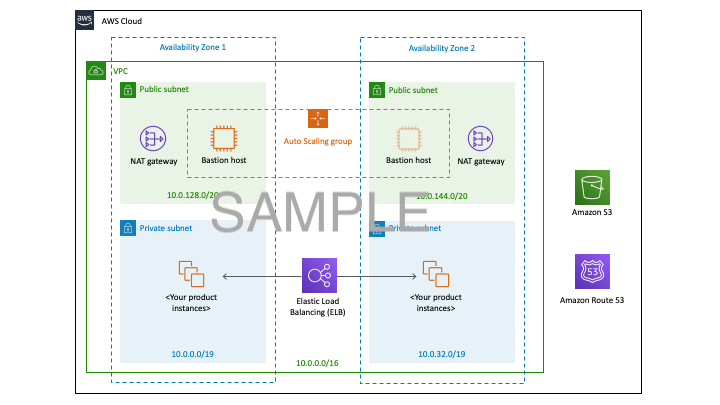

:xrefstyle: short

This Quick Start provides separate AWS CloudFormation templates to support three deployment scenarios. For each scenario, you also have the option to create a new virtual private cloud (VPC) or use your existing VPC infrastructure. Choose the scenario that best fits your needs.

// Replace this example diagram with your own. Follow our wiki guidelines: https://w.amazon.com/bin/view/AWS_Quick_Starts/Process_for_PSAs/#HPrepareyourarchitecturediagram. Upload your source PowerPoint file to the GitHub {deployment name}/docs/images/ directory in this repo. 

**Scenario 1: Deploy and manage your own AD DS installation on the Amazon EC2 instances, AWS Directory Service (AD Connector) and FreeRADIUS MFA-enabled Amazon WorkSpaces.** The AWS CloudFormation template for this scenario builds the AWS Cloud infrastructure, sets up and configures AD DS and AD-integrated DNS on the AWS Cloud. It then configures AWS Directory Service (AD Connector) and launches MFA-enabled WorkSpace for the specified user. You can also choose to deploy the Quick Start into your existing VPC infrastructure.

**Scenario 2: Deploy AWS Directory Service for Microsoft Active Directory (AWS Managed Microsoft AD) and FreeRADIUS MFA-enabled Amazon WorkSpaces.** The AWS CloudFormation template for this scenario builds the base AWS Cloud infrastructure, then deploys AWS Managed Microsoft AD on the AWS Cloud and MFA-enabled WorkSpace. AWS Directory Service takes care of AD DS tasks such as building a highly available directory topology, monitoring domain controllers, and configuring backups and snapshots. You can choose to deploy the Quick Start into an existing VPC infrastructure.

**Scenario 3: Deploy FreeRADIUS MFA-enabled WorkSpace into an existing AWS Directory Service**. The AWS CloudFormation template for this scenario builds the base AWS Cloud infrastructure for FreeRADIUS MFA-enabled WorkSpace in your existing AWS Directory Service (AWS Managed Microsfot AD) or (AD Connector). You can also choose to deploy the Quick Start into your existing VPC infrastructure.

For all new AD DS installations, the Quick Start also deploys AD DS and AD-integrated DNS, and it sets up Active Directory sites and subnets.

The following sections discuss the Quick Start architecture for each scenario.

== Scenario 1: Deploy self-managed AD, AD Connector and WorkSpace==

Scenario 1 is based on a new installation of AD DS in the AWS Cloud with AWS Directory Service - AD Connector and WorkSpaces. 

[#architectureScenario1]
.Quick Start architecture for {partner-product-short-name} on AWS

As illustrated in Figure 1, the AWS CloudFormation templates that automate this deployment set up the following (with an option to deploy a certificate authority in Availability Zone 1):

A VPC configured with public and private subnets in two Availability Zones for high availability.*

In the public subnets:

Managed network address translation (NAT) gateways to allow outbound internet access for resources in the private subnets.*

Remote Desktop Gateway (RD Gateway) instances in an Auto Scaling group to help secure remote access to instances in private subnets.*

In the private subnets:

A Windows Server forest and domain functional level, including security groups and rules for traffic between instances.

AWS Systems Manager Automation documents to set up and configure AD DS and AD-integrated DNS.

AWS Secrets Manager to store passwords.

* The template that deploys the Quick Start into an existing VPC skips the components marked by asterisks and prompts you for your existing VPC configuration.

In this architecture, domain controllers are deployed into two private VPC subnets in separate Availability Zones, making AD DS highly available. NAT gateways are deployed to public subnets, providing outbound internet access for instances in private subnets. Remote Desktop Gateways are deployed in an Auto Scaling group to the public subnets to help secure remote access to instances in private subnets. You can deploy an optional certificate authority in Availability Zone 1.

Windows Server 2019 is used for the Remote Desktop Gateway instances and the domain controller instances. The AWS CloudFormation template deploys AWS resources, including a Systems Manager Automation document. When the second node is deployed, it triggers execution of the Automation document through Amazon EC2 user data. The automation workflow deploys the required components, finalizes the configuration to create a new AD forest, and promotes instances in two Availability Zones to Active Directory domain controllers.

To deploy this stack, follow the step-by-step instructions in the Deployment Steps section. After deploying this stack, you can move on to deploying your AD DS-dependent servers into the VPC. The DNS settings for new instances will be ready via the updated DHCP options set that is associated with the VPC. You’ll also need to associate the new instances with the domain member security group that is created as part of this deployment.

== Scenario 2: Deploy AWS Managed Microsoft AD and Amazon WorkSpaces==

Scenario 2 is similar to scenario 1, except that it includes AWS Directory Service managed AD provisioning and WorkSpaces on the AWS Cloud. Instead of fully managing AD DS yourself, you rely on AWS Directory Service for tasks such as building a highly available directory topology, monitoring domain controllers, and configuring backups and snapshots.

AWS Directory Service deploys AD DS across multiple Availability Zones, and automatically detects and replaces domain controllers that fail. AWS Directory Service also handles time-consuming tasks such as patch management, software updates, data replication, snapshot backups, replication monitoring, and point-in-time restores. For more information about AWS Directory Service, see product details and the AWS documentation.

[#architectureScenario2]
.Quick Start architecture for {partner-product-short-name} on AWS

As shown in Figure 2, the AWS CloudFormation templates that automate this deployment set up the following (except for the virtual private network (VPN) gateway, VPN connection, and customer gateway, which you create manually):

A VPC configured with public and private subnets in two Availability Zones for high availability.*

In the public subnets:

Managed NAT gateways to allow outbound internet access for resources in the private subnets.*

RD Gateway instances in an Auto Scaling group to help secure remote access to instances in private subnets.*

In the private subnets:

Windows Server forest and domain functional level, including security groups and rules for traffic between instances.

AWS Systems Manager Automation documents to set up and configure AD DS and AD-integrated DNS.

AWS Secrets Manager to store passwords.

* The template that deploys the Quick Start into an existing VPC skips the components marked by asterisks and prompts you for your existing VPC configuration.

Scenario 2 provides an example of using a VPC and a virtual private gateway to enable communication with your own network over an IPsec VPN tunnel. Active Directory is deployed in the customer data center, and Windows servers are deployed into two VPC subnets. After deploying the VPN connection, you can promote the Windows instances to domain controllers in the on-premises Active Directory forest, making AD DS highly available in the AWS Cloud.

After you deploy the VPN connection and promote your servers to domain controllers, you can launch additional instances into the empty VPC subnets in the web, application, or database tier. These instances will have access to cloud-based domain controllers to help set up secure, low-latency directory services and DNS. All network traffic, including AD DS communication, authentication requests, and Active Directory replication, is secured either within the private subnets or across the VPN tunnel.

== Scenario 3: Deploy WorkSpace in an existing AWS Directory Service==
Scenario 2 is for users who want to use their existing deployments of AWS Directory Service. In this scenario, the template deploys FreeRADIUS MFA-enabled WorkSpace in an existing AWS Directory Service.

[#architectureScenario3]
.Quick Start architecture for {partner-product-short-name} on AWS

As shown in Figure 3, the AWS CloudFormation templates that automate this deployment set up the following:

A VPC configured with public and private subnets in two Availability Zones for high availability.*

In the public subnets:

Managed NAT gateways to allow outbound internet access for resources in the private subnets.*

RD Gateway instances in an Auto Scaling group to help secure remote access to instances in private subnets.*

In the private subnets:

(Optional) A Windows EC2 instance to act as a management instance, including security groups and rules for traffic between instances.

AWS Systems Manager Automation documents to set up and configure AD DS and AD-integrated DNS.

AWS Secrets Manager to store passwords.

AWS Directory Service to provision and manage AD DS in the private subnets.

* The template that deploys the Quick Start into an existing VPC skips the components marked by asterisks and prompts you for your existing VPC configuration.